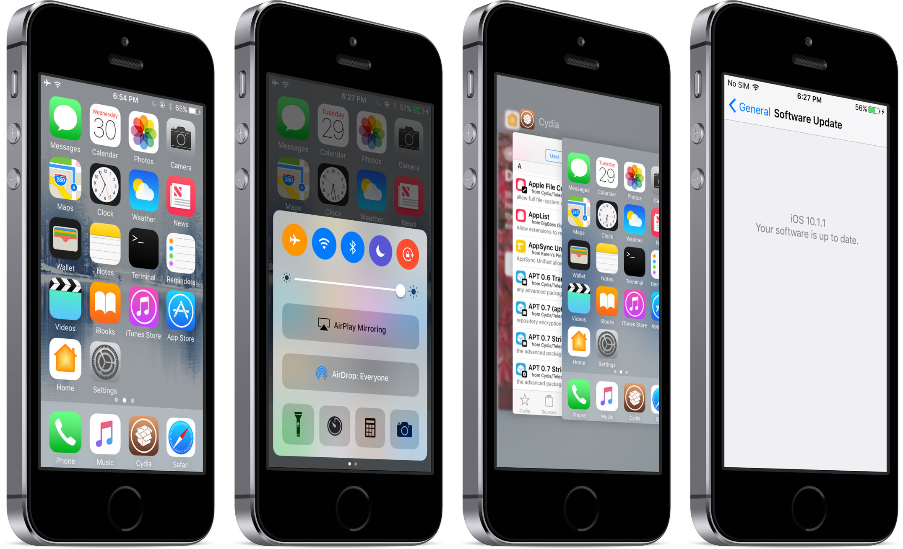
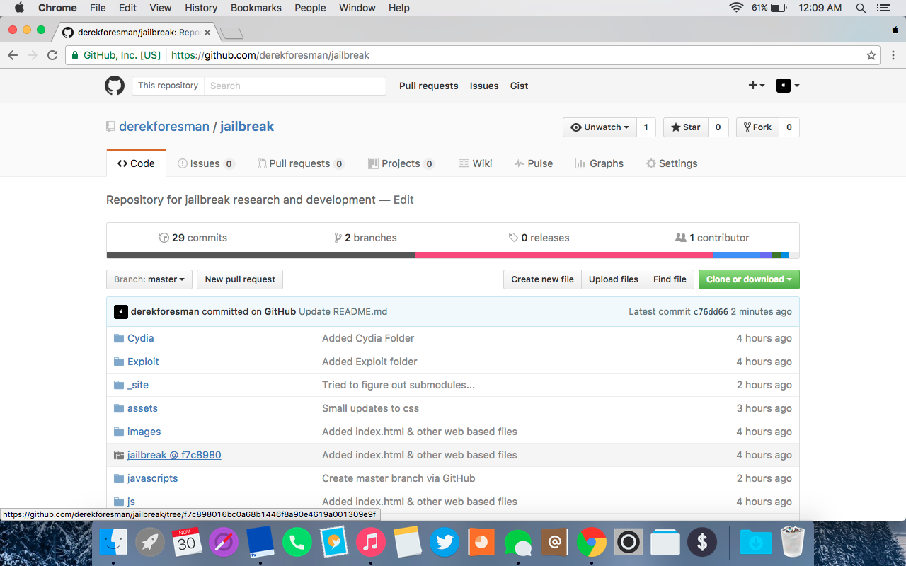

# iOS Jailbreaking and Security - Derek Foresman 

[© 2016 MTAC](https://twitter.com/mtac8 "MTAC Twitter")



This is the repository that I will be using to document my progress and maintain the code used in my private iOS 10.X jailbreak and resources and research used for jailbreaks for previous versions of iOS.

# Daily Progress

* Tuesday, November 29th 2016 - Started Github Repository to document my progress and manage all the code needed for my independent project



# Daily Reflection

* Tuesday, November 29th 2016 - 
  
  ```How did you perform today?``` Today was the first day of the 3 week ColLab period. We focused on the principles of what the responsibilities of ColLabs and how to handle the time properly. The rubrics for successful projects were given with the first two best catagories left intentionally blank, which each filled with their own opinion of an excellent project. I added qualities I felt I would need to have a successful three weeks. I focused on time management and the responsibility of completing all assignments, reflections and updates on time with plenty of expressed effort.
  
 ```What factors contributed to your performance?``` A large driving factor in my personal project is the fact that I enjoy the logic behind the idea of a jailbreak. The idea of legally breaking something made to be secure for the purpose to make it even more resilient, has always interested me. The logic behind an iOS jailbreak is extremely complicated programmatically, but my extensive prior knowledge on the topic is very helpful as I don't need to spend a large amount of my time learning new methods. Another factor to my success is the fact I am doing this independently. The point of a ColLab has a collaborative emphasis, but in my case, unless my partner had the knowledge base equivalent to mine, too much time spent learning the methods necessary to developing a jailbreak, would be counterproductive. If I were to work with a partner, graphic design is also a small part of this process, as the development of an appealing tool helps with its popularity.
 
 ```What goals and priorities can you set tonight that will help you perform even better tomorrow?``` I can start my outline which maps the process of going from nothing to a jailbreak with all requirements met of a sellable piece of software. I will make sure my reflections and check-ins make sense in a "normal person" readable language. In addition to the technical aspect of mobile exploitation which I plan on explaining the best of my ability, I will go into the social stigmas involving hacking, its legality and questionable morals due to lack of knowledge about the subject.
