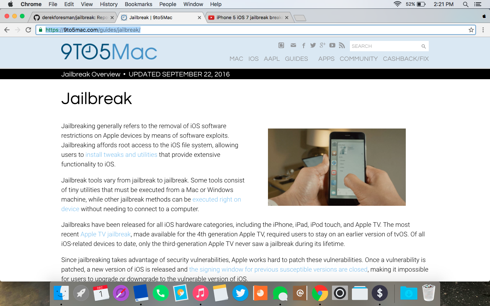

# iOS Jailbreaking and Security - Derek Foresman 

[© 2016 MTAC](https://twitter.com/mtac8 "MTAC Twitter")

This is the repository that I will be using to document my progress and maintain the code used in my private iOS 10.X jailbreak and resources and research used for jailbreaks for previous versions of iOS.

# Daily Updates

* Friday, December 2nd - 3:30 AM - After multiple attempts (the log file shows 108 attempts) I finally got iOS 7.1.2 on an iPhone 4 to boot into verbose mode. In order for verbose mode which is the scrolling text, an iBoot exploit must be used. iBoot cannot be patched by a software update, because the only way to modify its code is to either release a new version of the iDevice or to have a special tool that is illegal to possess unless you are Apple. There are exploits in iBoot that are read only, which means, no matter the iOS version on the read/write memory, a jailbreak exists for the device. [iBoot Verbose Boot Video]()

* Thursday, December 1st 2016 - 4:30 PM - I continued to reverse engineer Apple File Conduit. I used open source tools like [libimobiledevice](http://www.libimobiledevice.org/) and [libirecovery](https://github.com/libimobiledevice/libirecovery) to find how the computer communicates over USB with the iBoot/iBSS on the iDevice. I also started to look into hardware based exploits like those for iBoot, like Limera1n, and SHAtter.

* Thursday, December 1st 2016 - 2:30 PM - I changed the direction of the day a little bit by starting to disassemble the binaries of the processes used by iTunes on a desktop operating system, that are responsible for the transfer of files over usb to specific directories on an iDevice. I loaded it into Hopper Disassembler to view the process behind the compiled binary since the source of it is owned by Apple and currently unavailable to the public.

* Thursday, December 1st 2016 - 1:30 PM - Reaching out to Jeff Benjamin [@JeffBenjam](https://twitter.com/JeffBenjam) of [9to5mac.com](https://9to5mac.com/). Jeff and 9to5Mac cover the most recent updates in the jailbreak scene. For people looking for more information on jailbreaking, [this](https://9to5mac.com/guides/jailbreak/) post provides useful information on the comcept. Check this page for the most accurate updates.

* Thursday, December 1st 2016 - 11:30 PM - Started reaching out to developers of popular Cydia tweaks. I have previously recorded podcasts with prominent developers like William Vabrinskas [@william_vab](https://twitter.com/william_vab), Matt Clarke [@matchstic](https://twitter.com/_Matchstic), Andy Wiik [@Andywiik](https://twitter.com/Andywiik), Brian Olencki [@bolencki13](https://twitter.com/bolencki13).

* Wednesday, November 30th 2016 - 10:45 AM - Continued the review of [TaiG's](http://taig.com "TaiG Jailbreak") tool from the article [here](http://www.newosxbook.com/articles/TaiG2.html "The Annotated guide to TaiG"). The intentional abuse of internal Apple tools and services to reach arbitrary code execution. In the case of TaiG for iOS 8, the use of AFC or Apple File Conduit which is an internal service built into applications like iTunes, and responsible for the transfer of files from a computer to the filesystem of an iDevice over a USB cable with the use of USBMux. Examined the difference in modified AMFI.kext responsible for file signature checks on iOS 7.1.2.

* Wednesday, November 30th 2016 - 10:00 AM - Started the analysis of [TaiG's](http://taig.com "TaiG Jailbreak") tool used in the iOS 8.1.3 through iOS 8.4 jailbreak. I will be comparing the different exploits and methods used from each jailbreak for modern(ish) versions of iOS (6-10). Next step - Reach out to Jonathan for a possible interview. N.B. FileMon is amazing.

* Wednesday, November 30th 2016 - 9:15 AM - Compiled [Jonathan Levin's](https://newosxbook.com "Newosxbook.com") Jtool for ARM Cortex-A9 processor architecture on iPhone 4s for debugging of 32 bit binaries. Once compiled, I set up necessary keys for SSH access to iPhone 4s over wifi.

* Tuesday, November 29th 2016 - Started Github Repository to document my progress and manage all the code needed for my independent project

